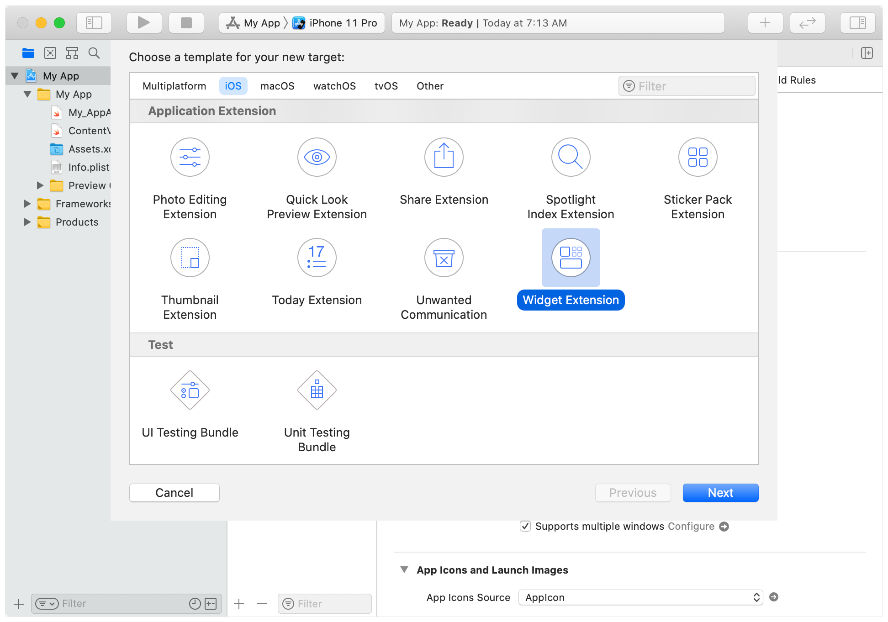

# 创建一个小部件扩展

添加并配置一个扩展，以在iOS主屏幕和macOS通知中心上显示你的应用程序的内容。

## 概述

Widget可以直观的显示相关内容，让用户快速进入您的应用了解更多细节。您的应用程序可以提供**多种小部件**，让用户专注于对他们最重要的信息。

用户可以添加同一小部件的多个副本，根据他们的独特需求和布局来**定制**每个小部件。如果您允许Widget的自定义功能，用户可以单独定制每个Widget。

Widget支持多种尺寸；您可以选择最适合您的应用程序内容的尺寸。然而由于可用**空间有限**，请让您的Widget专注于呈现人们最重视的信息。

将Widget添加到您的应用程序中仅仅需要少量的设置。Widget使用 SwiftUI 视图显示其内容。更多信息，请参阅SwiftUI。

## 在您的应用程序中添加一个小部件

小部件扩展模板可以方便您快速创建一个Widget。一个小部件扩展可以包含多种小部件。

例如，一个体育应用可能有一个显示球队信息的Widget和另一个显示比赛时间表的Widget。单个Widget扩展可以包含这两种Widget。虽然建议将所有的widget包含在一个widget扩展中，但如果有必要，您可以添加多个扩展。

1. 在Xcode中打开您的应用程序项目，然后选择文件>新建>目标。
2. 从应用程序扩展组中，选择Widget扩展，然后单击 "下一步"。
3. 输入扩展名的名称。
4. 如果小部件提供了用户可配置的属性，请选中 "包含配置意图 "「Include Configuration Intent checkbox」复选框。
5. 单击 "完成"。



## 添加配置信息

小部件扩展模板提供了一个符合小部件协议的初始小部件实现。

该Widget的`body`属性决定了该Widget是否具有**用户可配置的属性**。

有两种配置可供选择。

- `StaticConfiguration`: 对于一个没有用户可配置属性的Widget。「例如，显示一般市场信息的股票市场Widget，或显示趋势标题的新闻Widget。」

- `IntentConfiguration`。对于一个具有用户可配置属性的Widget来说，你可以使用`SiriKit`自定义意图来定义属性。您使用 `SiriKit` 自定义意图来定义属性。「例如，一个天气Widget需要一个城市的邮政编码或邮政编码，或者一个包裹跟踪Widget需要一个跟踪号码。」

包含配置意图「Include Configuration Intent」复选框决定了Xcode使用哪种配置。当您选择这个复选框时，Xcode使用将使用默认设置进行配置；

否则，它使用静态配置。要初始化配置，请提供以下信息。

- `kind`。识别Widget的字符串。这是您选择的标识符，应描述Widget所代表的内容。
- `Provider`：符合`TimelineProvider`的对象。一个符合`TimelineProvider`的对象，它能产生一个时间线，告诉`WidgetKit`何时渲染Widget。时间线包含一个你定义的自定义`TimelineEntry`类型。时间线条目标识了你希望WidgetKit更新Widget内容的日期。在自定义类型中包含你的Widget的视图需要渲染的属性。
- `Placeholder`。一个 SwiftUI 视图，WidgetKit 用来在第一次渲染Widget。占位符是您的Widget的通用表示，没有特定的配置或数据。
- Content Closure（内容闭合）。一个包含SwiftUI视图的封闭。`WidgetKit`调用它来渲染Widget的内容，从提供者那里传递一个`TimelineEntry`参数。
- Custom Intent（自定义配置）。一个定义用户可配置属性的自定义意图。有关添加自定义的更多信息，请参见制作可配置的Widget。

使用修饰符来提供额外的配置细节，包括显示名称(name)、描述(description)和Widget支持的系列(families)。

以下代码显示了一个通用的、不可配置的状态的游戏Widget。

```Swift
@main // 声明为主要部件
struct GameStatusWidget: Widget { // 声明为Widget // 而不是 some view
    var body: some WidgetConfiguration { // widget配置项
        StaticConfiguration( // 静态配置 StaticConfiguration
            kind: "com.mygame.game-status", // 唯一标识符
            provider: GameStatusProvider(), // 时间线提供者
            placeholder: GameStatusPlaceholderView() // placeholder
        ) { entry in // 显示的内容
            GameStatusView(entry.gameStatus)
        }
        .configurationDisplayName("Game Status") // 显示的名称
        .description("Shows an overview of your game status") // 描述
        .supportedFamilies([.systemSmall, .systemMedium, .systemLarge]) // 支持的widget大小
    }
}
```

在这个例子中，Widget使用GameStatusPlaceholder作为占位符视图，GameStatusView作为内容封闭。

占位符视图显示您Widget的通用表示，让用户对Widget显示的内容有一个大致的了解。**不要在占位符视图中包含实际数据**「例如，使用灰色框来表示文本行，或使用灰色圆圈来表示图像。」「骨架图」

Provider为Widget生成一个时间线，并在每个条目中包含游戏状态细节。当每个时间线条目的日期到来时，WidgetKit会调用内容封闭来显示小组件的内容。最后，修改器指定小部件图库中显示的名称和描述，并允许用户选择小部件的小、中、大版本。

请注意 @main 属性在此小组件上的用法。此属性表示 GameStatusWidget 是小组件扩展的入口点，意味着扩展包含一个小组件。要支持多个小组件，请参见在您的应用程序扩展中声明多个小组件。

## Provider 时间线配置(Provide Timeline Entries)

Provider会生成由时间线条目组成的时间线，每个条目都指定了更新小组件内容的日期和时间。游戏状态小组件可以定义其时间线条目，以包含一个代表游戏状态的字符串，如下所示：

```swift
struct GameStatusEntry: TimelineEntry {
    var date: Date
    var gameStatus: String
}
```

为了在小组件图库中显示你的小组件，WidgetKit会要求提供者提供一个预览快照。你可以通过检查传递给 snapshot(for:with:completion:)方法的上下文参数的 isPreview 属性来识别这个预览请求。当isPreview为真时，WidgetKit会在小组件库中显示你的小组件。作为回应，你需要快速创建预览快照。如果你的widget需要花时间从服务器生成或获取的资产或信息，请使用样本数据代替。

在下面的代码中，当游戏状态部件还没有从服务器获取状态时，Provider通过显示一个空状态来实现snapshot方法。

```swift
struct GameStatusProvider: TimelineProvider {
    var hasFetchedGameStatus: Bool
    var gameStatusFromServer: String

    func snapshot(with context: Context, completion: @escaping (Entry) -> ()) {
        let date = Date()
        let entry: GameStatusEntry

        if context.isPreview && !hasFetchedGameStatus {
            entry = GameStatusEntry(date: date, gameStatus: "—")
        } else {
            entry = GameStatusEntry(date: date, gameStatus: gameStatusFromServer)
        }
        completion(entry)
    }
```

在请求初始快照后，WidgetKit调用timeline(for:with:completion:)向提供者请求一个常规的时间线。时间线由一个或多个时间线条目和一个重载策略组成，告知WidgetKit何时请求后续时间线。
下面的例子显示了游戏状态部件的Provider如何生成一个时间线，该时间线由一个单一条目组成，其中包含来自服务器的当前游戏状态，以及一个在15分钟内请求新时间线的重载策略。

```swift
struct GameStatusProvider: TimelineProvider {
    func timeline(with context: Context, completion: @escaping (Timeline<GameStatusEntry>) -> ()) {
        // 为 "现在 now"创建一个时间轴条目。
        let date = Date()
        let entry = GameStatusEntry(
            date: date,
            gameStatus: gameStatusFromServer
        )

        // 创建一个未来15分钟的日期。
        let nextUpdateDate = Calendar.current.date(byAdding: .minute, value: 15, to: date)!

        // 创建带有条目的时间线 & 带有日期的重载策略。
        // 以便下次更新。
        let timeline = Timeline(
            entries:[entry],
            policy: .after(nextUpdateDate)
        )

        // 调用completion将时间线传递给WidgetKit。
        completion(timeline)
    }
}
```

在这个例子中，如果Widget没有来自服务器的当前状态，它可以存储对completion的引用`也是说不再更新了？`，向服务器执行异步请求以获取游戏状态，并在该请求完成时调用completion。
关于生成时间线的更多细节，包括在小组件中处理网络请求，请参见《让小组件保持最新状态》「[Keeping a Widget Up To Date](https://developer.apple.com/documentation/widgetkit/keeping-a-widget-up-to-date)」。

## 在Widget中显示内容

Widget使用SwiftUI视图来定义它们的内容，通常是通过调用其他SwiftUI视图来实现。如上图所示，widget的配置包含WidgetKit调用的闭包来渲染widget的内容。
当用户从Widget库中添加你的Widget时，他们会从你的Widget支持的系列中选择特定的规格（小、中、大）。Widget的内容必须能够渲染Widget支持的每个规格。WidgetKit在SwiftUI环境中设置了相应的大小「Family」和附加属性，例如配色方案（亮色或暗色）。

在上图所示的游戏状态Widget的配置中，内容闭合使用GameStatusView来显示状态。由于widget支持所有三个widget规格，所以它使用widgetFamily来决定显示哪个特定的SwiftUI视图，如图所示。

```swift
struct GameStatusView : View {
    @Environment(\.widgetFamily) var family: WidgetFamily // 获取环境变量
    var gameStatus: GameStatus

    @ViewBuilder
    var body: some View {
        switch family {
        case .systemSmall: GameTurnSummary(gameStatus)
        case .systemMedium: GameStatusWithLastTurnResult(gameStatus)
        case .systemLarge: GameStatusWithStatistics(gameStatus)
        default: GameDetailsNotAvailable()
        }
    }
}
```

对于规格为小的Widget来说，小部件使用的视图显示了一个简单的摘要，说明在游戏中轮到谁了。对于中等的，它显示的是状态，表示上一回合的结果。对于大户，因为有更多的空间，它可以显示每个玩家的运行统计。如果规格是未知类型，则显示默认视图，表示游戏状态不可用。

> #### Note
> 视图用@ViewBuilder声明其主体，因为它使用的视图类型不同。

对于可配置的widget，提供者符合IntentTimelineProvider。该提供者执行与TimelineProvider相同的功能，但它结合了用户在小组件上自定义的值。在传递给 snapshot(for:with:completion:)和 timeline(for:with:completion:)的配置参数中，这些自定义值可供 Intent Timeline 提供者使用。您通常将用户配置的值作为您的自定义时间线条目类型的属性包含在内，以供小组件的视图使用。

> #### Important
>
> 小组件只显示只读信息，不支持互动元素，如滚动元素或开关。WidgetKit在渲染widget的内容时，会省略交互式元素。

当用户与你的widget交互时，WidgetKit会激活你的应用，并传递一个你指定的URL。当你的应用激活时，通过将用户带到相关位置来处理URL。

## 为Widget添加动态内容

虽然小组件的显示是基于视图的快照，但您可以使用各种 SwiftUI 视图，这些视图在您的小组件可见时持续更新。有关提供动态内容的更多信息，请参见 "保持 Widget 更新"。

## 在应用程序扩展中声明多个Widget

上面的GameStatusWidget示例使用@main属性为widget扩展指定了一个单一的入口点。要支持多个widget，请声明一个符合WidgetBundle的结构，该结构在其body属性中将多个widget分组。在这个widget bundle结构上添加@main属性来告诉WidgetKit你的扩展支持多个widget。
例如，如果游戏应用有第二个widget来显示角色的健康状况，第三个widget来显示排行榜，它就会像这里一样把它们分组。

```swift
@main
struct GameWidgets: WidgetBundle {
    @WidgetBundleBuilder
    var body: some Widget {
        GameStatusWidget()
        CharacterDetailWidget()
        LeaderboardWidget()
    }
}
```

