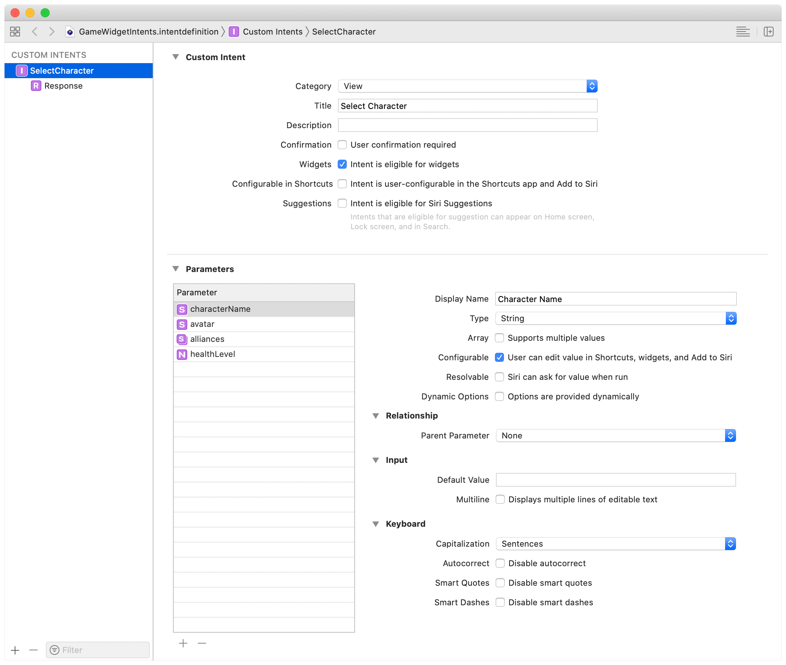

# IntentTimelineProvider Protocol

# IntentTimelineProvider

一个通知WidgetKit何时更新用户**可配置**widget的显示的类型

## 定义

```swift
protocol IntentTimelineProvider
```

## 概述

Intent时间线提供者执行与TimelineProvider相同的功能，但它也将用户配置的细节纳入时间线条目中。
例如，在一个显示用户选择的游戏角色的健康状态的小组件中，提供者收到了一个指定要显示的角色的自定义意图。在Xcode项目中，您可以定义一个自定义的SiriKit意图定义文件。意图定义可以包括角色的详细信息，如它的名字、头像、战略联盟等。



Xcode生成以下INIntent自定义意图。

```swift
public class SelectCharacterIntent: INIntent {
    @NSManaged public var characterName: String?
    @NSManaged public var avatar: String?
    @NSManaged public var alliances: [String]?
    @NSManaged public var healthLevel: NSNumber?
}
```

因为用户可以添加一个特定widget的多个实例，你的提供者需要一种方法来区分WidgetKit询问的是哪个实例。

当WidgetKit调用snapshot(for:with:completion:)或timeline(for:with:completion:)时，它会传递一个您的自定义INIntent的实例，并配置了用户选择的详细信息。

游戏widget提供者访问intent的属性并将其包含在TimelineEntry中。然后，WidgetKit调用widget配置的内容闭合，传递时间线条目以允许视图访问用户配置的属性。例如，提供者可以实现一个TimelineEntry，其属性与自定义意图中的属性相对应。「译者注：例如自动生成的代码中的 `SampleEntry`」

```swift
struct CharacterDetailEntry: TimelineEntry {
    var date: Date
    var name: String?
    var avatar: String?
    var alliances: [String]?
    var healthLevel: Double?
}
```

要生成快照，游戏小组件提供者使用来自意图的属性初始化角色细节条目。

```swift
struct CharacterDetailProvider: IntentTimelineProvider {
    func snapshot(for configuration: SelectCharacterIntent, with context: Context, completion: @escaping (CharacterDetailEntry) -> ()) {
        let entry = CharacterDetailEntry(
            date: Date(),
            name: configuration.characterName,
            avatar: configuration.avatar,
            alliances: configuration.alliances,
            healthLevel: configuration.healthLevel?.doubleValue
        )
        completion(entry)
    }
}
```

## Topics「参照10. TimelineProvider 此处不再赘述」

### Generating Timelines

[`func snapshot(for: Self.Intent, with: Self.Context, completion: (Self.Entry) -> ())`](doc://com.apple.documentation/documentation/widgetkit/intenttimelineprovider/snapshot(for:with:completion:)?language=swift)

Provides a timeline entry representing the current time and state of a widget.

**Required.**

[`func timeline(for: Self.Intent, with: Self.Context, completion: (Timeline) -> ())`](doc://com.apple.documentation/documentation/widgetkit/intenttimelineprovider/timeline(for:with:completion:)?language=swift)

Provides an array of timeline entries for the current time and, optionally, any future times to update a widget.

**Required.**

[`associatedtype Entry : TimelineEntry`](doc://com.apple.documentation/documentation/widgetkit/intenttimelineprovider/entry?language=swift)

**Required.**

[`associatedtype Intent : INIntent`](doc://com.apple.documentation/documentation/widgetkit/intenttimelineprovider/intent?language=swift)

**Required.**

### Type Aliases

[`typealias Context`](doc://com.apple.documentation/documentation/widgetkit/intenttimelineprovider/context?language=swift)

## See Also

### Related Documentation

[`class INIntent`](doc://com.apple.documentation/documentation/sirikit/inintent?language=swift)

A request to fulfill in your app or Intents extension.