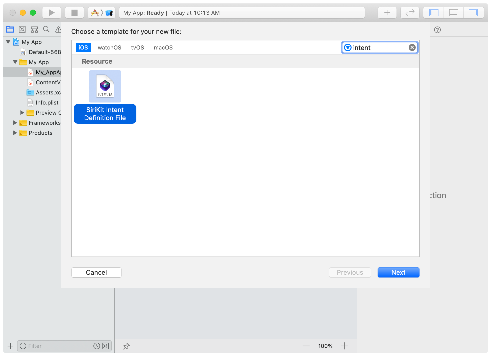
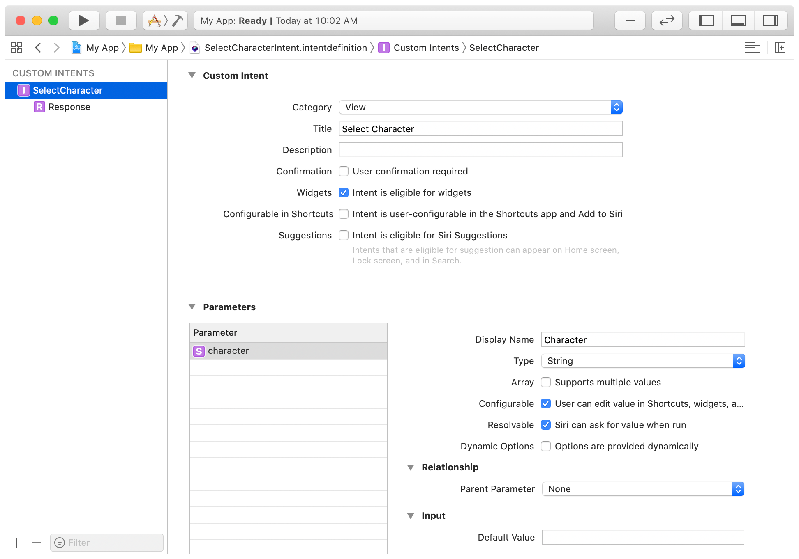
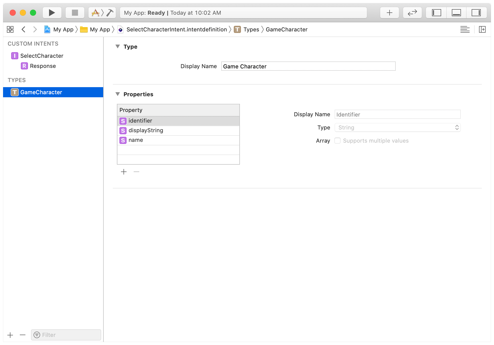

# 制作一个可配置的小部件

通过在您的项目中添加自定义SiriKit意图定义，让用户可以选择自定义他们的小部件。

## 概述

为了使用户能够轻松访问最相关的信息，小组件可以提供可定制的属性。例如，用户可以为股票报价小组件选择特定的股票，或为包裹交付小组件输入跟踪号码。小组件通过使用自定义意图定义来定义可定制的属性，与Siri建议和Siri快捷方式用于定制这些交互的机制相同。

添加可配置的属性到您的widget中。

1. 添加一个定义可配置属性的自定义意图定义到你的Xcode项目中。
2. 在您的widget中使用`IntentTimelineProvider`来将用户的选择纳入您的时间线条目中。
3. 如果属性依赖于动态数据，请实现一个`Intents`扩展。

如果您的应用程序已经支持 Siri 建议或 Siri 快捷方式，并且您有一个自定义意图，您可能已经完成了大部分工作。否则，请考虑利用您为小组件所做的工作来添加对 Siri 建议或 Siri 快捷方式的支持。有关如何充分利用意图的更多信息，请参阅 SiriKit。
下一节介绍如何给显示游戏中角色信息的小组件添加可配置属性。

## 为您的项目添加自定义意图定义

在你的Xcode项目中，选择File > New File并选择SiriKit Intent Definition File。点击 "下一步 "并在提示时保存文件。Xcode创建一个新的.intenttdefinition文件，并将其添加到您的项目中。



Xcode从意图定义「intent definition file」文件中生成代码。要在一个目标「target」中使用这些代码。

- 将intent定义文件作为目标的一个成员。
- 通过添加 intent 的类名到 target 属性的 Supported Intents 部分来指定要包含在 target 中的特定 intents。

如果您将 intent 定义文件包含在框架中，您还必须将其包含在包含应用程序的 target 中。在这种情况下，为了避免应用程序和框架中的类型重复，请在 "文件 "检查器的 "目标成员 "部分中为应用程序目标选择 "不生成类"。

****

要添加和配置一个自定义意图，让用户在游戏中选择一个角色。

1. 在项目导航器中，选择意图文件。Xcode显示一个空的意图定义编辑器。
2. 选择 Editor > New Intent 并选择 Custom Intents 下的 intent。
3. 将自定义意图的名称改为SelectCharacter。请注意，"属性检查器 "的 "自定义类 "字段显示了您在代码中引用该意图时使用的类名。在本例中，它是SelectCharacterIntent。
4. 将Category（类别）设置为View（视图），并选择 "Intent is eligible for widgets "「意图有资格成为小部件」复选框，以表明widgets可以使用该intent。
5. 在 "Parameters "下，添加一个新参数，以字符串作为名称，这是小组件的可配置设置。


添加一个参数后，为其配置细节。如果一个参数给用户提供了一个静态的选择列表，那么选择 "添加枚举 "菜单项来创建一个静态枚举。

例如，如果一个参数指定了一个角色的头像，而可能的头像列表是一个不变的集合，你可以使用一个静态枚举，在意图定义文件中指定可用的选择。

如果可能的头像列表可以变化，或者是动态生成的，可以使用带有动态选项的类型代替。

在本例中，字符属性依赖于应用程序中可用的动态字符列表。要提供动态数据，请创建一个新类型。

1. 点击 "左下角 + 按钮"，选择 "New Type"。Xcode在编辑器的Types部分添加一个新类型。

2. 将该类型的名称改为GameCharacter。
   添加一个新的name属性，并从类型弹出菜单中选择String。

3. 选择 SelectCharacter intent。

4. 在意图编辑器中，选择 "选项是动态提供的「Options are provided dynamically」 "复选框，以表明您的代码为该参数提供了一个动态项目列表。



GameCharacter类型描述了用户可以选择的字符。在下一节中，你将添加代码来动态地提供字符列表。

> #### Note
>
> 意图中参数的顺序决定了用户编辑小组件时它们的显示顺序。您可以通过拖动列表中的项目来重新排序。

****

### 为您的项目添加一个Intent扩展

要动态地提供字符列表，你需要在你的应用程序中添加一个Intents扩展。当用户编辑widget时，WidgetKit会加载Intents扩展来提供动态信息。

添加一个 Intents 扩展。

1. 选择File > New > Target 并选择 Intents Extension。

2. 点击 "下一步"。

3. 为你的Intents扩展名输入一个名字，并将Starting Point(起始点)设置为none。

4. 单击 "Finish"。如果Xcode提示您激活新方案，请点击激活。

5. 点击根对象，找到左侧边栏的Targets中刚新建的对象。在其"General"选项卡中，在   "Supported Intents"部分添加一个条目，并将 "Class Name"设置为"SelectCharacterIntent"。

   

6. 在 "项目导航器 "中，选择您之前添加的自定义意图定义文件。

7. 使用文件检查器「File inspector」将Intent文件添加到意图扩展目标中。

> #### Important
>
> 在文件检查器中，验证包含的应用程序、小组件扩展名和意图扩展名是否都包含意图Intent Definition文件。

### 实现一个意图处理程序来提供动态值

当用户使用提供动态值的自定义意图编辑小组件时，系统需要一个对象来提供这些值。它通过要求Intents扩展为意图提供一个处理程序来识别这个对象。

当Xcode创建Intents扩展时，它向您的项目添加了一个名为IntentHandler.swift的文件，其中包含一个名为IntentHandler的类。这个类包含一个返回处理程序的方法。**您将扩展该处理程序，为小组件的自定义提供值。**

基于自定义的意图定义文件，Xcode会生成一个协议，即SelectCharacterIntentHandling，该处理程序必须符合这个协议。将这个符合性添加到IntentHandler类的声明中。(要查看这个协议的细节，以及Xcode自动生成的其他类型，请选择SelectCharacterIntentHandling并选择Navigate > Jump to Definition)。

```swift
class IntentHandler: INExtension, SelectCharacterIntentHandling {
    ...
}
```

当一个处理程序提供动态选项时，它必须实现一个名为`provide[Type] OptionalCollection(for:with:)`的方法，其中[Type]是来自意图定义文件的类型名称。如果缺少这个方法，Xcode会报告一个构建错误，并提供一个添加协议存根的修复方法。

构建您的项目，并使用fix-it来添加这个存根。
该方法包括一个您调用的完成处理程序，传递一个INObjectCollection<GameCharacter>。请注意GameCharacter类型；这是意图定义文件中的自定义类型。Xcode生成定义它的代码如下。

```swift
public class GameCharacter: INObject {
    @available(iOS 13.0, macOS 10.16, watchOS 6.0, *)
    @NSManaged public var name: String?
}
```

请注意name属性，它也来自于你添加的自定义类型的意图定义文件。
为了实现provideCharacterOptionsCollection(for:with:)方法，widget使用一个存在于游戏项目中的结构。这个结构定义了一个可用角色的列表和它们的详细信息，如下所示。

```swift
struct CharacterDetail {
    let name: String
    let avatar: String
    let healthLevel: Double
    let heroType: String

    static let availableCharacters = [
        CharacterDetail(name: "Power Panda", avatar: "🐼", healthLevel: 0.14, heroType: "Forest Dweller"),
        CharacterDetail(name: "Unipony", avatar: "🦄", healthLevel: 0.67, heroType: "Free Rangers"),
        CharacterDetail(name: "Spouty", avatar: "🐳", healthLevel: 0.83, heroType: "Deep Sea Goer")
    ]
}
```

在意图处理程序中，遍历availableCharacters数组，为每个角色创建一个GameCharacter对象。为了简单起见，GameCharacter的标识是角色的名字。游戏角色数组被放入一个INObjectCollection中，处理程序将该集合传递给完成处理程序。

```swift
class IntentHandler: INExtension, SelectCharacterIntentHandling {
    func provideCharacterOptionsCollection(for intent: SelectCharacterIntent, with completion: @escaping (INObjectCollection<GameCharacter>?, Error?) -> Void) {

        // 迭代可用的字符
        // 每个都有一个GameCharacter。
        let characters: [GameCharacter] = CharacterDetail.availableCharacters.map { character in
            let gameCharacter = GameCharacter(
                identifier: character.name,
                display: character.name
            )
            gameCharacter.name = character.name
            return gameCharacter
        }

        // 用字符数组创建一个集合。
        let collection = INObjectCollection(items: characters)

        // 调用完成处理程序，传递集合。
        completion(collection, nil)
    }
}
```

完成了意图定义文件的配置，并将意图扩展添加到应用程序中，用户就可以编辑小组件来选择要显示的特定字符。WidgetKit使用意图定义文件中的信息自动创建编辑小组件的用户界面。

一旦用户编辑小组件并选择了一个字符，下一步就是将该选择纳入小组件的显示中。

### 处理用户自定义的值

为了支持可配置的属性，小组件使用 IntentTimelineProvider 配置。例如，Character-detail小组件定义其配置如下。

```swift
struct CharacterDetailWidget: Widget {
    var body: some WidgetConfiguration {
        IntentConfiguration(
            kind: "com.mygame.character-detail",
            intent: SelectCharacterIntent.self,
            provider: CharacterDetailProvider(),
            placeholder: CharacterPlaceholderView()
        ) { entry in
            CharacterDetailView(entry: entry)
        }
        .configurationDisplayName("Character Details")
        .description("Displays a character's health and other details")
        .supportedFamilies([.systemSmall, .systemMedium, .systemLarge])
    }
}
```

SelectCharacterIntent参数决定了小组件的用户可定制属性。

配置使用 CharacterDetailProvider 来管理小组件的时间线事件。有关时间线提供者的更多信息，请参见 "保持 Widget 更新"。

在用户编辑小组件后，WidgetKit会在请求时间线条目时将用户自定义的值传递给提供者。您通常会在提供者生成的时间线条目中包含来自意图的相关细节。

在这个例子中，提供者使用一个辅助方法，使用意图中的角色名称来查找CharacterDetail，然后创建一个包含该角色细节的条目的时间线。

```swift
struct CharacterDetailProvider: IntentTimelineProvider {
    func timeline(for configuration: SelectCharacterIntent, with context: Context, completion: @escaping (Timeline<CharacterDetailEntry>) -> ()) {
        // 访问 intent 的自定义属性
        let characterDetail = lookupCharacterDetail(for: configuration.character.name)

        // 构造一个当前日期的时间线条目，并包含人物细节
        let entry = CharacterDetailEntry(date: Date(), detail: characterDetail)

        // 创建时间线并调用完成处理程序。配置为Never - 永不刷新
        // 策略表明包含的应用程序将使用WidgetCenter方法。
        // 当细节发生变化时，重新加载小组件的时间线
        let timeline = Timeline(entries: [entry], policy: .never)
        completion(timeline)
    }
}
```

当您在时间线条目中包含用户自定义的值时，您的小组件可以显示适当的内容。