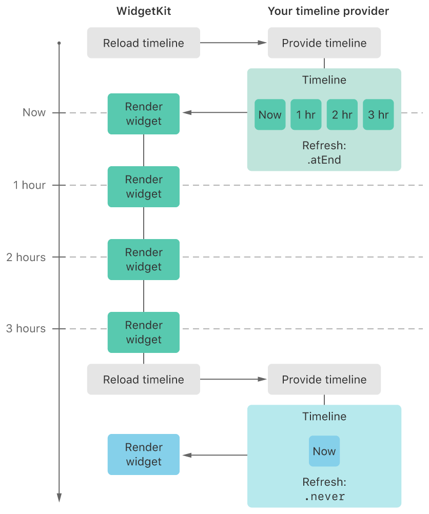
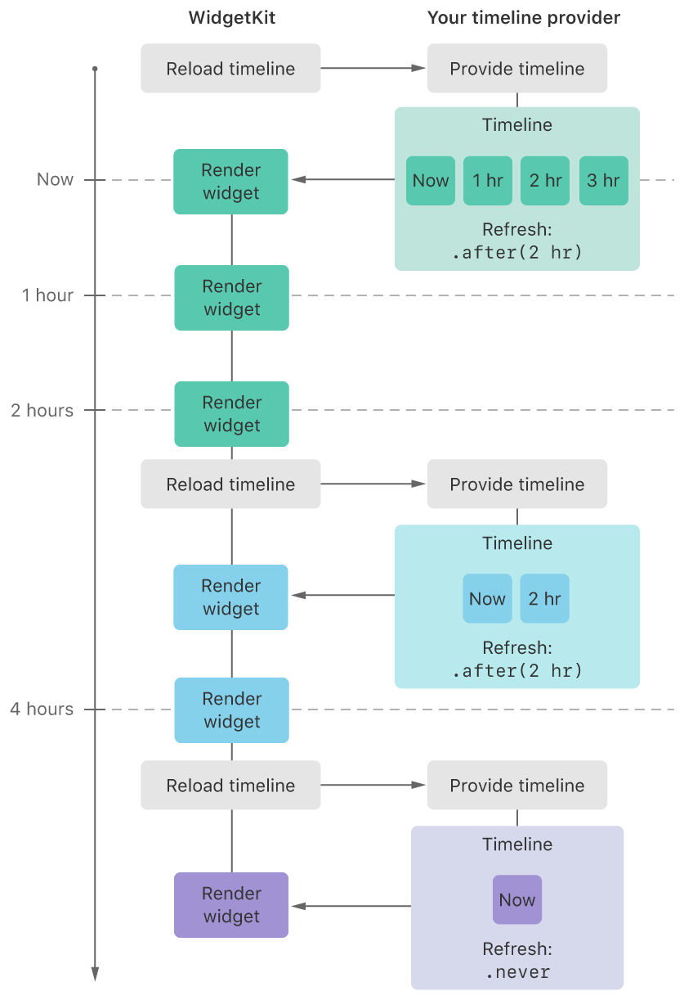

# 保持组件状态为最新(Keeping a Widget Up To Date)

规划您的小组件的时间线，以使用动态视图显示及时的相关信息，并在事情发生变化时更新时间线。

## 概述

Widget使用SwiftUI视图来显示它们的内容。WidgetKit在一个单独的过程中代表您渲染视图。因此，即使小组件在屏幕上，您的小组件扩展也不会持续活跃。尽管您的widget并不总是处于活动状态，但有几种方法可以使其内容保持最新。

### 为可预测的事件生成一个时间轴

许多小组件有可预测的时间点，在这些时间点上更新其内容是有意义的。例如，一个显示天气信息的小组件可以在一天中**每小时更新一次温度**。一个股票市场的小部件可以在**开市时间频繁更新其内容**，但在**周末则完全不更新**。通过提前规划这些时间，WidgetKit会在合适的时间到来时自动刷新你的widget。

当你定义你的widget时，你实现了一个自定义的`TimelineProvider`。WidgetKit从你的provider那里获取一个时间线，并使用它来跟踪何时更新你的widget。时间线是一个`TimelineEntry`对象的**数组**。时间线中的每个条目都有**日期和时间**，以及小组件显示其视图所需的**附加信息**。除了时间线条目，**时间线还指定了一个刷新策略，该策略告诉WidgetKit何时请求新的时间线。**

下面是一个显示角色健康水平的游戏小部件的例子。

当健康水平低于100%时，角色以每小时25%的速度恢复。例如，当角色的健康水平为25%时，需要3小时才能完全恢复到100%。下图显示了WidgetKit如何从provider那里请求时间线，在时间线条目中指定的每个时间渲染小部件。



当WidgetKit最初请求时间轴时，provider会创建一个有四个条目的时间轴。第一个条目代表当前的时间(Now)，之后是每小时一次的三个条目。在刷新策略设置为默认的`atEnd`的情况下，**WidgetKit会在时间线条目中的最后一个日期之后请求一个新的时间线。**当时间线中的每个日期到达时，WidgetKit会调用小组件的内容闭包显示结果。在最后一个时间线条目过后，WidgetKit会**重复**这个过程，**要求提供者提供一个新的时间线**。由于角色的健康度已经达到了100%，提供者会以当前时间的单一条目和刷新策略设置为never来回应。在这种设置下，WidgetKit不会要求另一条时间线，直到应用程序使用WidgetCenter告诉WidgetKit请求新的时间线。

除了`atEnd`和`never`(永不刷新)策略之外，如果时间线可能在到达条目结束之前或之后**发生变化**，提供者可以指定不同的日期。例如，如果一条龙将在2小时后出现，向游戏角色发起战斗，那么provider就将重载策略设置为after(_:)，传递一个未来2小时的日期。下图显示了WidgetKit在2小时处渲染小部件后，如何请求一个新的小部件。



由于与龙的战斗，角色的治疗量需要额外2小时才能达到100%。新的时间线由两个条目组成，一个是当前时间，另一个是未来2小时后的条目。时间线为刷新策略指定了atEnd，表示没有更多的已知事件可能改变时间线。

当2个小时过去后，角色的健康状况达到100%时，WidgetKit会要求provider提供新的时间线。因为角色的健康状况已经恢复，**所以提供者会生成和上面第一张图一样的最终时间线**。当用户玩游戏，角色的健康水平发生变化时，应用会使用WidgetCenter让WidgetKit刷新时间线，更新小部件。

除了指定时间线结束前的日期，提供者还可以指定时间线结束后的日期。当您知道小组件的状态在以后才会改变时，这很有用。例如，股市小组件可以在周五收市时创建一个时间线，并使用 afterDate() 刷新策略指定周一市场开盘的时间。因为股市在周末休市，所以在市场开盘前不需要更新小组件。

****

### 当时间线改变时通知WidgetKit

当某件事情影响到小组件的当前时间线时，您的应用可以告诉WidgetKit请求新的时间线。在上面的游戏小组件示例中，如果应用程序收到推送通知，表明队友给角色提供了治疗药水，应用程序可以告诉WidgetKit重新加载时间线并更新小组件的内容。要重载特定类型的widget，你的应用使用WidgetCenter，如这里所示。

```swift
WidgetCenter.shared.reloadTimelines(ofKind: "com.mygame.character-detail")
```

kind参数包含与用于创建widget的WidgetConfiguration的值相同的字符串。

如果你的widget具有用户可配置的属性，那么通过使用WidgetCenter来验证是否存在具有适当设置的widget，从而避免不必要的重新加载。

例如，当游戏收到关于某个角色收到治疗药水的推送通知时，它会在重新加载时间线之前验证一个widget是否显示该角色。

在下面的代码中，应用程序调用getCurrentConfigurations(_:)来检索用户配置的小组件列表。然后，它遍历所产生的 WidgetInfo 对象，以找到一个具有接收治疗药水的角色所配置的意图的部件。如果它找到了一个，应用程序就会为该widget的种类调用reloadTimelines(ofKind:)。

```swift
WidgetCenter.shared.getCurrentConfigurations { result in
    guard case .success(let widgets) = result else { return }

    // 遍历WidgetInfo元素，找到符合的元素。
    // 来自推送通知的字符。
    if let widget = widgets.first(
        where: { widget in
            let intent = widget.configuration as? SelectCharacterIntent
            return intent?.character == characterThatReceivedHealingPotion
        }
    ) {
        WidgetCenter.shared.reloadTimelines(ofKind: widget.kind)
    }
}
```

如果你的应用使用WidgetBundle来支持多个widget，你可以使用WidgetCenter来重新加载所有widget的时间线。例如，如果您的widget需要用户登录到一个账户，但他们已经登出，您可以通过调用重新加载所有widget。

```swift
WidgetCenter.shared.reloadAllTimelines()
```

****

### 显示动态日期

因为你的widget扩展并不总是在运行，所以你不能直接更新widget的内容。取而代之的是，WidgetKit代表你渲染你的widget的视图并显示结果。然而，一些SwiftUI视图可以让你在你的widget**可见时显示持续更新的内容。**

在您的小组件中使用文本视图，您可以在屏幕上显示保持最新的日期和时间。

以下示例显示了可用的组合。

#### 要显示自动更新的相对时间

```swift
let components = DateComponents(minute: 11, second: 14)
let futureDate = Calendar.current.date(byAdding: components, to: Date())!

Text(futureDate, style: .relative)
// Displays:
// 11 min, 14 sec

Text(futureDate, style: .offset)
// Displays:
// -11 minutes
```

使用相对样式(.relative)显示当前日期和时间与指定日期之间的绝对差异，无论日期是在未来还是在过去。

偏移样式(.offset)显示当前日期和时间与指定日期之间的差异，用减号(-)前缀表示未来的日期，用加号(+)前缀表示过去的日期。

#### 要继续显示自动更新的计时器。

```swift
let components = DateComponents(minute: 15)
let futureDate = Calendar.current.date(byAdding: components, to: Date())!

Text(futureDate, style: .timer)
// Displays:
// 15:00
```

对于未来的日期，定时器显示为倒数时间，直到当前时间到达指定的日期和时间，并在日期过去后向上计数。

#### 要显示绝对日期或时间。

```swift
// Absolute Date or Time
let components = DateComponents(year: 2020, month: 4, day: 1, hour: 9, minute: 41)
let aprilFirstDate = Calendar.current(components)!

Text(aprilFirstDate, style: .date)
Text("Date: \(aprilFirstDate, style: .date)")
Text("Time: \(aprilFirstDate, style: .time)")

// Displays:
// April 1, 2020
// Date: April 1, 2020
// Time: 9:41AM
```

#### 最后，显示两个日期之间的时间间隔。

```swift
let startComponents = DateComponents(hour: 9, minute: 30)
let startDate = Calendar.current.date(from: startComponents)!

let endComponents = DateComponents(hour: 14, minute: 45)
let endDate = Calendar.current.date(from: endComponents)!

Text(startDate ... endDate)
Text("The meeting will take place: \(startDate ... endDate)")

// Displays:
// 9:30AM-2:45PM
// The meeting will take place: 9:30AM-2:45PM
```

****

### 使用地图视图显示位置

小组件通过使用SwiftUI MapView来显示地图。要在小组件中显示地图，请执行以下操作。

1. 将`UIWidgetWantsLocation`键添加到你的widget扩展的Info.plist文件中，值为true。
2. 在包含应用程序的 Info.plist 文件中包含使用目的字符串(usage-purpose)。
3. 在包含应用程序中请求访问位置信息的权限。
4. 有关请求位置授权和使用目的字符串的更多信息，请参阅请求位置服务的授权。

### 后台网络请求完成后更新

当您的小组件扩展处于活动状态时，例如提供快照或时间线时，它可以启动后台网络请求。

这个过程类似于应用程序如何处理这种类型的请求，这在 "在后台下载文件 "中描述。

WidgetKit没有恢复你的应用，而是直接激活你的widget的扩展。

要处理网络请求的结果，使用 onBackgroundURLSessionEvents(matching:_:) 修饰符到你的 widget的配置中，并执行以下操作。
- 存储一个对完成参数的引用 您在处理完所有网络事件后调用完成处理程序。

- 使用标识符参数找到您在发起后台请求时使用的 URLSession 对象。如果您的widget扩展被终止，请使用标识符重新创建URLSession。

  在调用onBackgroundURLSessionEvents()后，系统会调用你提供给URLSession的URLSessionDelegate的urlSession(_:downloadTask:didFinishDownloadingTo:)方法。当所有的事件都被交付后，系统会调用委托人的urlSessionDidFinishEvents(forBackgroundURLSession:)方法。
  要在网络请求完成后刷新你的widget的时间线，从你的委托人的urlSessionDidFinishEvents的实现中调用WidgetCenter方法。一旦你处理完这些事件，就调用之前存储在onBackgroundURLSessionEvents()中的完成处理程序。